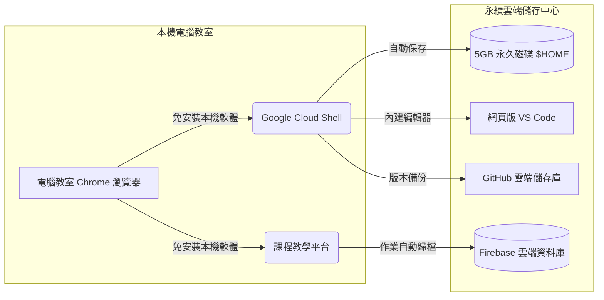

# 萬能科技大學《商業軟體應用》── Vibe Coding ✕ Agentic AI 智慧辦公實務操作手冊

> **授課班級**：進修部 企業管理系 四系 1 甲  
> **授課教師**：邱俊維 博士 (Dr. Chun-Wei Chiu) ｜ 育英樓 J801-1 研究室  
> **諮詢時間**：每週一 15:00~16:00、週四 14:00~16:00 (敬請事先預約)  
> **聯絡信箱**：jimchiu@mail.vnu.edu.tw  
> **參考依據**：萬能科技大學 0910 研習《Vibe Coding 操作手冊》與商業軟體實務

---

## 📌 目錄
1. [電腦教室還原特性說明與 Google 雲端永續環境](#一電腦教室還原特性說明與-google-雲端永續環境)
2. [第 01 週環境建置與帳號開通 SOP](#二第-01-週環境建置與帳號開通-sop)
3. [什麼是 Vibe Coding？企管系同學的商業優勢](#三什麼是-vibe-coding企管系同學的商業優勢)
4. [商務提問黃金法則：CLEAR 提示詞框架](#四商務提問黃金法則clear-提示詞框架)
5. [GitHub 雲端儲存與靜態發布指引](#五github-雲端儲存與靜態發布指引)
6. [課堂 5 分鐘示範：雜亂會議紀錄轉結構化表格](#六課堂-5-分鐘示範雜亂會議紀錄轉結構化表格)
7. [常見操作問題排解手冊 (FAQ)](#七常見操作問題排解手冊-faq)

---

## 一、電腦教室還原特性說明與 Google 雲端永續環境

### 1. 電腦教室環境特性說明
J501 電腦教室為維持上課設備穩定與資安防護，每台電腦皆設有系統保護機制（硬體還原功能）。每當下課關機或重新開機，**本機 C 槽與桌面上儲存的個人檔案、下載的安裝軟體皆會恢復成初始設定**。

### 2. 解決方案：全面採用 Google 雲端永續環境
為了讓進修部同學不用每週重複安裝軟體，且下課關機後作業能妥善保存，本課程全面採用 **Google 雲端工具** 作為主要實作平台：



### 3. 三大雲端核心工具優勢
- **Google Cloud Shell (5GB 永久空間)**：只要有 Google 帳號即可免費啟用，內建 Linux 終端機與網頁版 VS Code，檔案儲存在家目錄 (`$HOME`)，永不因電腦重開機而消失。
- **Google Colab ＆ Google 雲端硬碟**：線上執行 Python 數據處理，檔案雙向同步個人雲端硬碟。
- **課程互動平台 (Firebase 雲端同步)**：以 Google 帳號登入，平時快測與作業上傳即時備份。

---

## 二、第 01 週環境建置與帳號開通 SOP

請同學依序完成以下 4 項設定：

```text
【步驟 1：Google 登入】➔【步驟 2：啟用 Cloud Shell】➔【步驟 3：註冊 GitHub】➔【步驟 4：建立工作目錄】
```

### 步驟 1：登入 Google 帳號並連結課程平台
1. 開啟 Chrome 瀏覽器，登入個人或學校 Google 帳號。
2. 進入本課程平台，點擊右上角 **`Google 登入`** 按鈕，完成學號與姓名設定。

### 步驟 2：開通 Google Cloud Shell 雲端主機
1. 在瀏覽器網址列輸入：`shell.cloud.google.com`。
2. 首次使用請點擊藍色 **`繼續 (Continue)`** 按鈕。
3. 稍候約 20 秒，即可看見終端機提示符號（如 `user@cloudshell:~$`）。
4. 點擊右上角工具列的 **`開啟編輯器 (Open Editor)`**，即可在瀏覽器展開完整的 VS Code 編輯畫面。

### 步驟 3：註冊 GitHub 帳號
1. 前往 `github.com` 註冊免費帳號（建議使用常用信箱）。
2. 至信箱收取驗證信，點擊確認完成啟用。

### 步驟 4：在雲端建立個人專屬作業資料夾
在 Cloud Shell 終端機中，輸入以下指令並按 Enter：
```bash
# 建立本學期專屬作業資料夾
mkdir -p ~/vnu_business_software/week01

# 切換至第一週目錄
cd ~/vnu_business_software/week01

# 確認目前所在目錄
pwd
```
畫面顯示 `/home/你的帳號/vnu_business_software/week01` 即代表環境建置成功！

---

## 三、什麼是 Vibe Coding？企管系同學的商業優勢

### 1. Vibe Coding（意圖驅動實作）核心理念
由電腦科學家 Andrej Karpathy 於 2025 年提出。其精神在於：商管與進修部同學不用花費大量時間死記硬背複雜語法，**你的核心定位是「商業專案經理 (Project Manager)」**！
你只需要運用清晰的自然語言，將商業情境、目標客群、排版要求與格式規範表達清楚，繁重的程式碼與檔案排版交由 AI 協助起草。

### 2. 企管系同學的三大核心價值
1. **商業問題理解力**：能看懂部門流程中的痛點與數據癥結。
2. **規格化溝通能力**：能把口語需求轉化為標準欄位與結構化清單。
3. **成果查核與驗收能力**：能核對 AI 產出的數字與內容是否合理、正確。

---

## 四、商務提問黃金法則：CLEAR 提示詞框架

提問越明確，AI 回應越實用。請參考 **CLEAR 提問五要素**：

| 要素 | 英文含意 | 實戰說明 | 企管課堂實作範例 (會議紀錄整理) |
|:---|:---|:---|:---|
| **C** | **Context（背景）** | 交代商業背景與專案情境 | 「我們是企業管理部門，剛結束每週各店主管營運例行會議。」 |
| **L** | **Limits（限制）** | 給予字數、格式、表格與排除條件 | 「請使用繁體中文；整理為 Markdown 表格；不可自行捏造未提及的事項。」 |
| **E** | **Expectation（期望）** | 具體指出最終希望交付的產出項目 | 「產出需包含：1. 會議摘要；2. 決議事項表格（案由、決議、負責人、完成期限）。」 |
| **A** | **Action（行動）** | 使用明確且具指向性的專業動詞 | 「請為我【整理並條列】以下逐字稿對話，轉為正式公文會議紀錄。」 |
| **R** | **Role（角色）** | 指定 AI 扮演的專家身分 | 「假設你是具備 10 年經驗的總經理室資深行政特助。」 |

---

## 五、GitHub 雲端儲存與靜態發布指引

全學期完全免費！透過 GitHub 可以保管作業，日後亦可將一頁式報告發布成公開網頁：

1. **新增儲存庫**：登入 GitHub ➔ 點選右上角 `+` ➔ `New repository` ➔ 命名為 `vnu-business-report` ➔ 設為 `Public` ➔ 點擊 `Create repository`。
2. **上傳檔案**：點選 `Add file` ➔ `Upload files` ➔ 拖曳檔案 ➔ 點擊 `Commit changes`。
3. **開啟 Pages 網頁**：進入 `Settings` ➔ 點選左側 `Pages` ➔ Branch 選擇 `main`，目錄選擇 `/ (root)` ➔ 點擊 `Save`。
4. **取得公開網址**：稍候約 1 分鐘即可取得專屬公開連結：`https://<你的帳號>.github.io/vnu-business-report/`。

---

## 六、課堂 5 分鐘示範：雜亂會議紀錄轉結構化表格

### 示範提示詞（可直接點擊平台複製）：
```text
【角色】：假設你是總經理室資深特助。
【背景】：部門剛結束門市營運會議，現場討論對話較為零碎雜亂。
【任務】：請將以下口語對話整理成正式的商業會議紀錄：
1. 會議核心摘要（3 點條列說明）。
2. 待辦工作追蹤表（包含欄位：項次、決議事項、主辦人員、協辦人員、預計完成日期）。
3. 提醒主管後續追蹤之注意事項（2 點）。
【限制】：使用繁體中文，格式工整清爽，未在對話中提及的日期請標示「待確認」。
【原始對話紀錄】：
店長阿明說下週一前要向總部回報冷氣故障報修，小美說排班表週三會交給我看，大華提到中秋禮盒DM印好了但還沒分送到各門市，預計週五前要由工讀生完成配送，另外大家都覺得目前每週會議時間太長，建議下次改為30分鐘。
```

---

## 七、常見操作問題排解手冊 (FAQ)

### Q1：下課後忘了存檔，重開機後檔案在電腦桌面找不到了？
> **說明**：這是電腦教室保護機制的正常現象。請同學養成「雲端儲存好習慣」：所有檔案都存放在 Google Cloud Shell 的家目錄 (`~/vnu_business_software`) 或個人 Google 雲端硬碟，下課前於課程平台完成作業繳交，檔案便永遠都在。

### Q2：Google Cloud Shell 終端機顯示「連線逾時 (Session Timeout)」怎麼辦？
> **說明**：Google 為節省伺服器資源，若超過 20 分鐘未輸入指令會暫時休眠。只要點擊畫面中央的 **`重新連線 (Reconnect)`** 按鈕，約 15 秒後即可恢復連線，家目錄檔案依然完整無缺。

### Q3：AI 產出的文字內容有時候不完全符合需求？
> **說明**：大型語言模型生成具備隨機性。如果不滿意，請運用 Vibe Coding 的自然語言微調原則，直接回覆一句話補充要求即可，例如：「請將表格欄位精簡為 3 欄，並將語氣調整得更正式一些。」

### Q4：在家裡用自己的筆電或平板也能繼續操作嗎？
> **說明**：可以！只要在個人電腦開啟 Chrome 瀏覽器並連線至 `shell.cloud.google.com` 與課程平台，輸入同一組 Google 帳號，就能完全延續在教室的操作進度。
